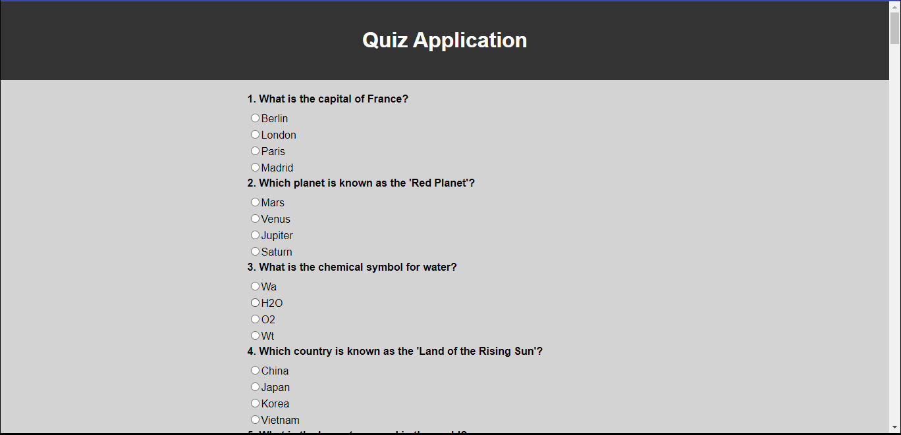

# Quiz Application

This is a simple interactive quiz application built using HTML, CSS, and JavaScript. The application presents users with a series of questions and options to choose from. After answering all the questions, users can submit their answers to see their score.



## Table of Contents

- [Features](#features)
- [Getting Started](#getting-started)
- [How to Use](#how-to-use)
- [Adding More Questions](#adding-more-questions)
- [Customization](#customization)
- [Contributing](#contributing)
- [License](#license)

## Features

- Interactive and user-friendly quiz interface
- Dynamically generated questions and options
- Immediate feedback on user's score after submission
- Easy to add more questions and customize the application

## Getting Started

To get started with the quiz application, you can follow these steps:

1. Clone this repository to your local machine using `git clone`.
2. Open the `index.html` file in your web browser.

Alternatively, you can also access the application online by visiting the [Quiz Application](https://ankigilbertokosso.github.io/SimpleQuizApp/).

## How to Use

1. Once the application is open, you will see the quiz questions along with the available options.
2. Select the desired option for each question by clicking the corresponding radio button.
3. After answering all the questions, click the "Submit" button to view your score.
4. Your score will be displayed, showing the number of correct answers and the percentage of correct responses.

## Adding More Questions

To add more questions to the quiz application, you can follow these steps:

1. Open the `script.js` file in your preferred code editor.
2. Locate the `quizData` array, which contains the existing questions and answers.
3. Add new question objects to the array following the existing structure:
   ```javascript
   {
     question: "Your new question here?",
     options: ["Option 1", "Option 2", "Option 3", "Option 4"],
     answer: "Correct Option",
   },
   ```
4. Save the changes and reload the `index.html` file in your web browser to see the new questions added to the quiz.

## Customization

The quiz application's appearance and styling can be customized to match your preferences. To make adjustments to the styles, you can modify the `styles.css` file in the project.

Feel free to experiment with colors, fonts, layout, or add additional features to enhance the user experience.

## Contributing

Contributions to the quiz application are welcome! If you find any bugs, have suggestions for improvements, or want to add more features, please create a pull request or open an issue.

## License

This project is licensed under the [MIT License](LICENSE). Feel free to use, modify, and distribute the code as per the terms of the license.

---

Enjoy using the interactive quiz application! If you have any questions or feedback, please don't hesitate to reach out. Happy quizzing!
